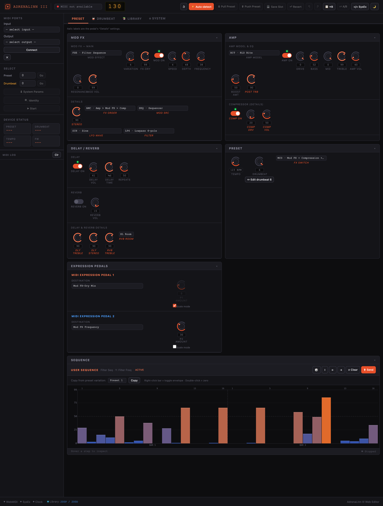
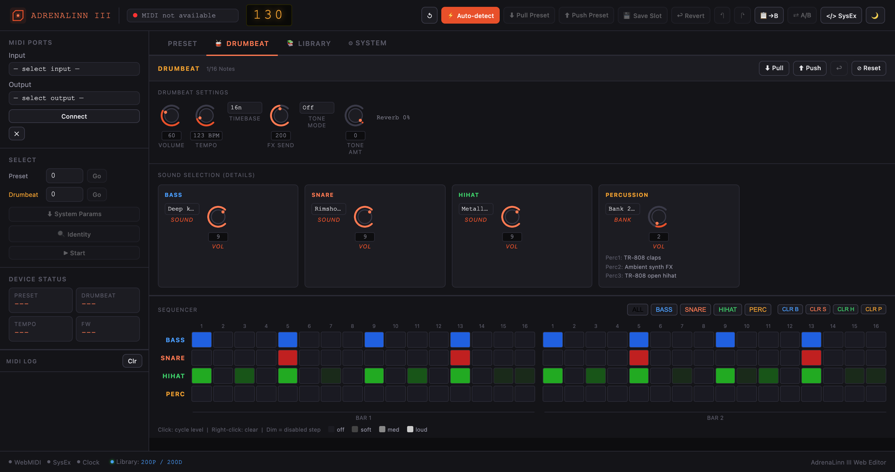
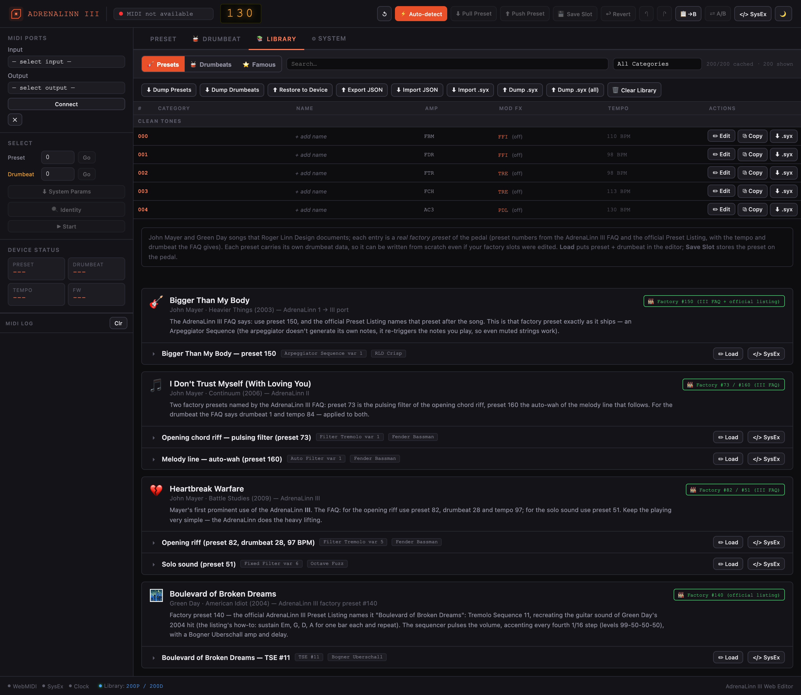
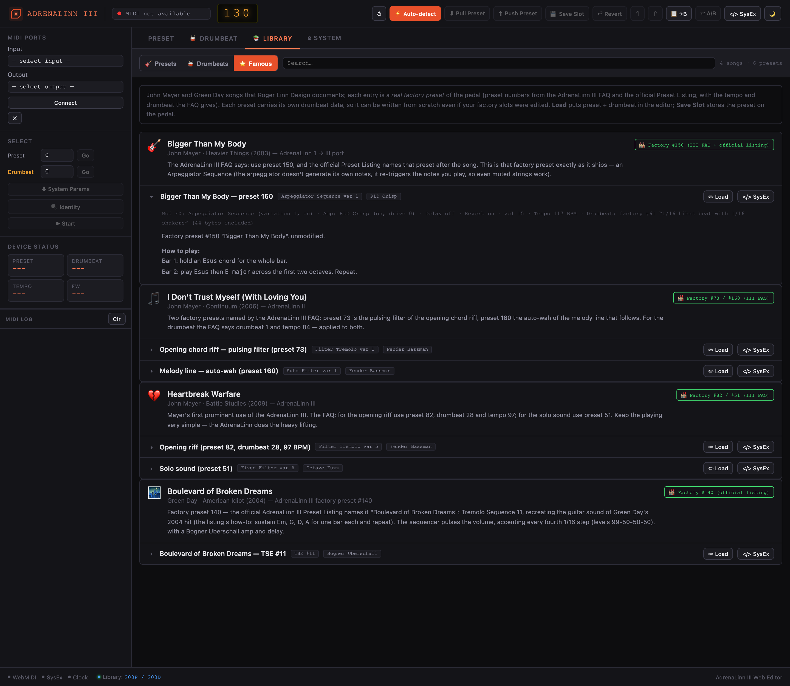
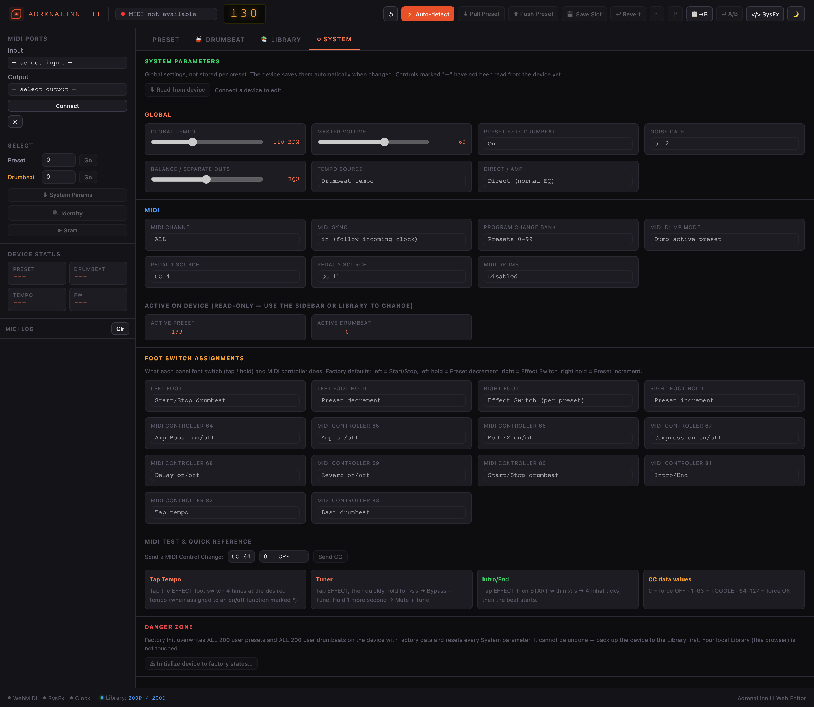
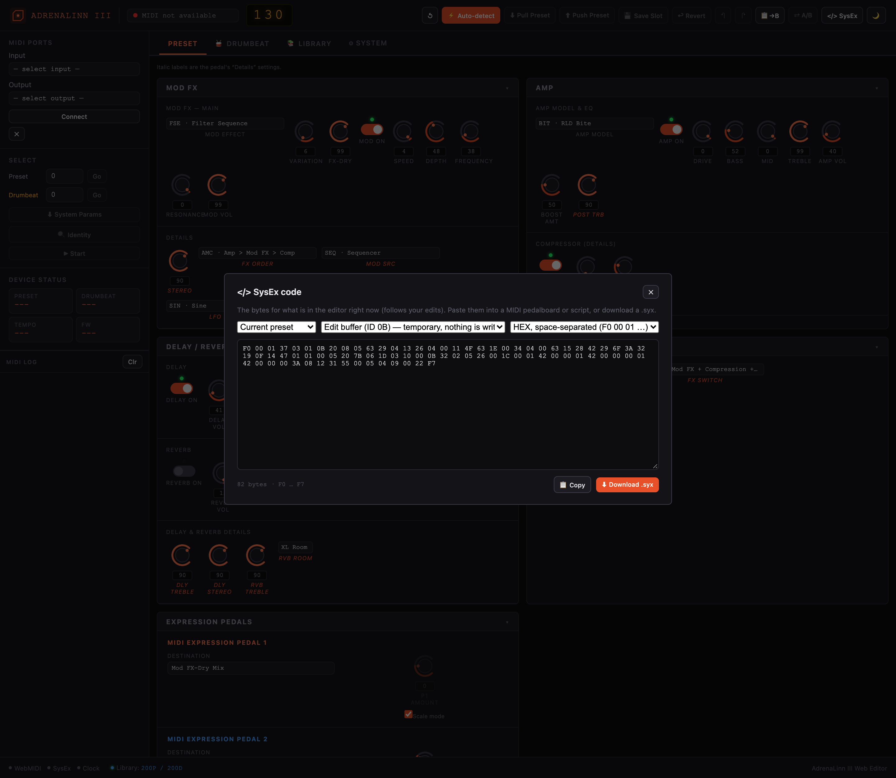

# AdrenaLinn III Web Editor

[](https://github.com/lucanenni/adrenalinn-iii-editor/actions/workflows/checks.yml)
[](LICENSE)

A complete web editor for the **AdrenaLinn III** guitar effects processor by Roger Linn Design.

**▶ Use it now: <https://lucanenni.github.io/adrenalinn-iii-editor/>** — nothing to install; open it in Chrome or Edge, connect the pedal over USB-MIDI and allow MIDI access. (Hosted on GitHub Pages; once loaded it also works offline.)

## Requirements

- **Browser**: Chrome or Edge (the only browsers with Web MIDI API + SysEx support)
- **Device connection**: USB-MIDI (plug-and-play on macOS/Windows/Linux)
- **Local server** (only if you run your own copy): any HTTP server, only for the *first* load (ES modules and Web MIDI both require a secure context, never `file://`) — a Service Worker then caches the app so later loads work fully offline, even with the server stopped

## Quick start

The easiest way is the hosted version above. To run your own copy:

```bash
git clone https://github.com/lucanenni/adrenalinn-iii-editor.git
cd adrenalinn-iii-editor

# Option A — Node.js
npx serve .

# Option B — Python
python3 -m http.server 8080

# Then open Chrome/Edge at:
# http://localhost:8080
```

## Page

One page, `http://localhost:8080/` — the editor with four tabs. Famous-song presets live in the LIBRARY tab (⭐ Famous) and the SysEx bytes of whatever is in the editor are one click away (`</> SysEx` in the header), so there is no separate builder.

## Features

### Main editor (`index.html`)
Four tabs:
- **PRESET** — every part of the current preset as cards on one scrollable screen (single column on phones; click a card title to collapse it): **MOD FX** (18 effects), **AMP** (40 models + compressor), **DELAY / REVERB**, **PRESET** (Tempo, Drumbeat, Effect Switch, and an "Edit drumbeat" button that opens the assigned drumbeat), **EXPRESSION PEDALS** and the 32-step **SEQUENCE** canvas. Effects, amps and the Details settings (FX Order, Mod Source, LFO Wave, Filter) show their full names, and Details are always visible.
- **DRUMBEAT** — 32-step × 4-voice sequencer with sound selection
- **LIBRARY** — 200-preset + 200-drumbeat library with bulk dump, custom names, slot-to-slot copy, JSON backup, per-slot `.syx` export/import, and Restore to Device (write cached slots back to the device's flash, one confirmed slot at a time)
- **SYSTEM** — global device settings (MIDI channel/sync, master volume, noise gate, Direct/Amp, tempo source, program-change bank, pedal sources, foot switch assignments…), a MIDI CC test sender, and Factory Init behind a typed confirmation

### Screenshots
Captured offline from the factory data (no device connected).

| PRESET | DRUMBEAT |
|---|---|
|  |  |
| **LIBRARY** | **LIBRARY → ⭐ Famous** |
|  |  |
| **SYSTEM** | **`</> SysEx` dialog** |
|  |  |

### MIDI features
- Auto-detect the device via Identity Request/Reply
- Real-time single-parameter send (turning a knob → instant SysEx)
- Pull a preset from the device edit buffer
- **Save to Slot** — save to a specific slot with Save Complete confirmation and an optional name
- Bulk dump of 200 presets / 200 drumbeats (1.1s delay/slot per spec)
- Playback cursor synced to incoming MIDI Clock
- Export/Import JSON and `.syx` files
- **A/B comparison** — compare two variations of the same preset without losing changes
- **Undo/Redo** — `Ctrl+Z` / `Ctrl+Y`, 20-state history
- **Dark/Light mode** — toggle in the header, persisted
- **Keyboard shortcuts** — `Ctrl+S` send, `Space` MIDI Start/Stop, arrow keys move between tabs, all controls keyboard-accessible

### Famous presets (LIBRARY → ⭐ Famous)
4 songs / 6 presets — John Mayer and Green Day, all **real factory presets** of the pedal, limited to what Roger Linn Design documents:
- **From the [AdrenaLinn III FAQ](https://www.rogerlinndesign.com/support/support-adrenalinn-faqs)** (preset, and drumbeat/tempo where it gives them): Bigger Than My Body (preset 150), I Don't Trust Myself (73 and 160, drumbeat 1, 84 BPM), Heartbreak Warfare (82 with drumbeat 28 and 97 BPM, solo 51).
- **Boulevard of Broken Dreams** (Green Day) is preset 140: the official [Preset & Drumbeat Listing](https://cdn.prod.website-files.com/5ad24a891dee8925107423d0/5e695429681006b84c9cc4f0_adrenalinn-iii-presets---drumbeats-manual%2C-11-25-07.pdf) names 140 and 150 after their songs; the preset and drumbeat names on the cards come from it.
- Three ways to use each preset: **💾 Write to slot…** (opens Save Slot, writes the preset to flash — the drumbeat stays as it is on the pedal), **⬆ Send live** (preset + drumbeat to the pedal's edit buffers, nothing saved), **`</> SysEx`** (the bytes of the preset and of its drumbeat to copy or download, without touching the editor or the pedal). **✏ Load** just puts both in the editor. Write and Send need a connected pedal.
- Every entry stores the full 64 preset bytes and the 44 drumbeat bytes, so it can be written from scratch even if the factory slots on your pedal were edited.
- Only John Mayer and Green Day songs that Roger Linn Design documents are listed. The AdrenaLinn *II* FAQ must not be used as a source: its preset numbers are for older models.

### SysEx code (`</> SysEx` in the header)
- The bytes of the current preset or drumbeat, live while you edit — also offline, so it works as a preset builder for MIDI pedalboards and scripts
- Edit buffer (ID 0B/0D), Send (ID 02/03) or the raw 64/44 data bytes; text as spaced HEX, continuous HEX, `0x` array or decimal; Copy, or download a `.syx`

### Backups
- **Export JSON** — the whole Library (slots, names, System parameters, edit buffers); the complete backup
- **Dump .syx** — all 200 presets or drumbeats as one `.syx` file in slot order, or both together (`Dump .syx (all)`). The pedal's messages carry no slot number, so slot N is the Nth message: re-import it here with *Import .syx* (then *Restore to Device* to write it to the pedal). A generic SysEx player would write every message to the same slot
- Per-slot `.syx` from the row buttons

## Project structure

```
adrenalinn-editor/
├── CLAUDE.md               ← Context for Claude Code
├── README.md               ← This file
├── ARTIFACTS.md             ← Artifact inventory / project status
├── SYSEX_PRESETS.md         ← Worked SysEx byte examples (real factory data)
├── index.html
├── sw.js                    ← Service Worker (offline app-shell cache)
├── manifest.json            ← PWA manifest
├── icon.svg                 ← App icon
├── self-test.html           ← Data round-trip test (visual)
├── test/                    ← Same round-trip test, runnable with plain Node (see Testing below)
├── .github/workflows/       ← CI: syntax + round-trip checks on every push
└── src/
    ├── midi/
    │   ├── sysex.js        ← All SysEx builders
    │   ├── midiManager.js  ← Web MIDI API wrapper
    │   ├── presetData.js   ← 64-byte preset structure
    │   ├── drumbeatData.js ← 44-byte drumbeat structure
    │   ├── systemData.js   ← System parameters (field table, parse/clamp, single-param builder)
    │   ├── syxFile.js      ← .syx split/build/read, dump files, byte-to-text formats
    │   └── famousPresets.js ← the famous-song presets (data only)
    ├── store/
    │   ├── presetStore.js
    │   ├── drumbeatStore.js
    │   ├── libraryStore.js
    │   └── systemStore.js
    └── components/
        ├── Knob.js
        ├── ModFxPanel.js
        ├── AmpPanel.js
        ├── DelayReverbPanel.js
        ├── SequenceEditor.js
        ├── SequencerGrid.js
        ├── DrumbeatPanel.js
        ├── PedalAssignPanel.js
        ├── PresetMetaPanel.js
        ├── SystemPanel.js
        ├── PresetBrowser.js
        ├── FamousPresetsPanel.js
        └── SysexDialog.js
```

## SysEx protocol

The device communicates over SysEx with the header `F0 00 01 37 03 01 [MSG_ID]`.

| MSG ID | Description |
|--------|-------------|
| `0x01` | Single Parameter |
| `0x02` | Send/Receive Preset (slot, writes flash) |
| `0x03` | Send/Receive Drumbeat (slot, writes flash) |
| `0x05` | Request Preset (specific slot) |
| `0x06` | Request Drumbeat (specific slot) |
| `0x09` | Select Preset |
| `0x08` | Select Drumbeat |
| `0x0A` | Request Preset Edit Buffer |
| `0x0B` | Send/Receive Preset Edit Buffer (temporary) |
| `0x0C` | Request Drumbeat Edit Buffer |
| `0x0D` | Send/Receive Drumbeat Edit Buffer (temporary) |
| `0x0E` | Request System Parameters |
| `0x0F` | Send/Receive System Parameters |
| `0x11` | Save Complete (device → host; no File Version byte) |
| `0x13` | Initialize to Factory Status (no File Version byte) |

## Bluetooth MIDI

Chrome supports BLE MIDI via the Web Bluetooth API. To enable it:
```
chrome://flags → enable-web-bluetooth-new-permissions-backend
```
On macOS, a standard Bluetooth MIDI adapter is enough (e.g. Yamaha MD-BT01).

## Offline use (PWA)

After the first load, a Service Worker (`sw.js`) caches the page and
every JS module, so the editor keeps working offline — reload it with no
server running and it still comes up. Chrome/Edge will also offer to
"install" it (via `manifest.json`) as a standalone app with its own window
and icon. This doesn't remove the need for a server on the *first* visit:
Web MIDI and ES modules both require a secure context (http(s) or
`localhost`), never `file://`.

## Testing

```bash
# Data round-trip checks for presetData.js / drumbeatData.js, systemData.js and SysEx framing, dump files, famous presets (415 checks)
node test/run.mjs

# Store / write-session behaviour against a fake pedal that reproduces what the real one does (~8 s)
node test/device.mjs

# Same checks, rendered visually in the browser
open http://localhost:8080/self-test.html

# Syntax-check every module + each entry point's inline script
for f in $(find src -name '*.js'); do node --check "$f"; done
node test/check-html-scripts.mjs

# sw.js PRECACHE_URLS lists every module and only files that exist
node test/check-precache.mjs
```

All of them run automatically on every push via GitHub Actions (`.github/workflows/checks.yml`).

### What a real pedal does that the MIDI spec doesn't say
Found by testing against hardware (firmware 3.0.3) and modelled in `test/fakePedal.mjs`:
- The System dump is 46 bytes (spec: 14); Save Complete and Factory Init need/carry the File Version byte; Factory Init sends no Save Complete.
- Writing a preset stamps a tempo into it chosen by Tempo Source (drumbeat tempo / System tempo / the slot's old tempo), ignoring the data's own — Restore / Save to Slot work around this (`src/store/writeSession.js`).
- Touching a Mod FX / Amp / Delay / Reverb parameter switches that block on, and a new effect loads its defaults — the editor reads the pedal back and follows.
- The default Pedal 1/2 sources are CC4 / CC11 (the MIDI doc says 27 / 32).

See [ARTIFACTS.md](ARTIFACTS.md) for what is still unverified.

## Developing with Claude Code

This project includes `CLAUDE.md` with full context for Claude Code sessions.

```bash
# Install Claude Code
npm install -g @anthropic-ai/claude-code

# Start a session in the project directory
cd adrenalinn-editor
claude
```

Common requests to make of Claude Code:
- _"Add parameter X to panel Y"_
- _"Implement improvement N from the list in CLAUDE.md"_
- _"Fix the bug in file Z at line W"_
- _"Add another preset to the famous-presets list"_

## Resources
- [Roger Linn Design — AdrenaLinn III Support](https://www.rogerlinndesign.com/support/support-adrenalinn)
- [AdrenaLinn III FAQs](https://www.rogerlinndesign.com/support/support-adrenalinn-faqs) — the source of the famous presets' preset numbers
- [MIDI Implementation](https://cdn.prod.website-files.com/5ad24a891dee8925107423d0/5e6955fd0f5a6069d69d92f8_adrenalinn_iii_midi_implementation%2C_8-1-07.pdf)
- [User's Manual](https://cdn.prod.website-files.com/5ad24a891dee8925107423d0/5e69542a4b96309cc90a9c12_adrenalinn-iii-users-manual%2C-v302%2C-5-14-08.pdf)
- [Presets & Drumbeats Manual](https://cdn.prod.website-files.com/5ad24a891dee8925107423d0/5e695429681006b84c9cc4f0_adrenalinn-iii-presets---drumbeats-manual%2C-11-25-07.pdf)
- [Web MIDI API — MDN](https://developer.mozilla.org/en-US/docs/Web/API/Web_MIDI_API)

## Disclaimer
This is an unofficial, independent project. It is not affiliated with or endorsed by Roger Linn Design; "AdrenaLinn" and "Roger Linn Design" belong to their owners. The factory presets and drumbeats of the pedal, their names and the manuals linked above are Roger Linn Design's work: the app includes only the bytes of the six factory presets (and their drumbeats) behind the famous-presets list, for convenience, and reads everything else from your own pedal.

## License
[MIT](LICENSE) — covers the code of this project, not Roger Linn Design's content.
